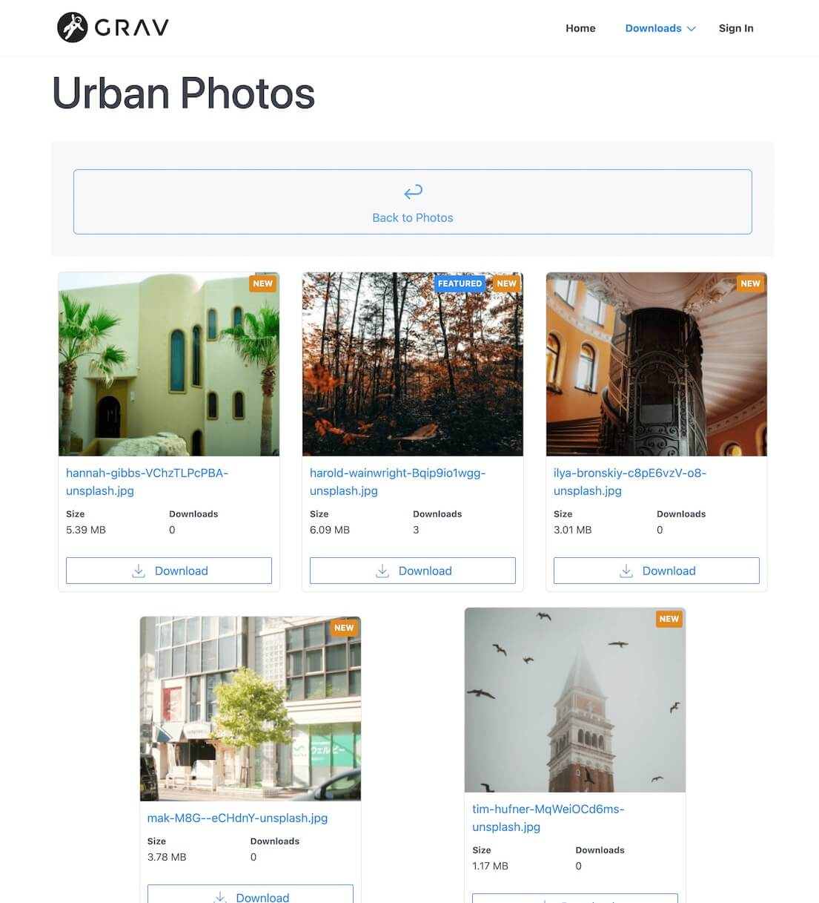

# Typhoon One-Page Skeleton

This skeleton serves as a demo for [Downloads Pro Grav Premium Plugin](https://getgrav.org/premium/downloads-pro).



## Installation

1. Download latest Grav package. [Grav 1.7](https://getgrav.org/download/core/grav/latest)

2. Unzip the `grav-v*.zip` file.

3. Download and unzip the `grav-skeleton-downloads-demo.zip` Skeleton package and unzip it.

4. Replace the default `user/` folder with this skeleton's extracted folder, and rename it to `user/`

5. Launch a terminal window and navigate to the root of your Grav installation

6. Confirm you can run CLI commands by typing `bin/gpm version`.  It should output the current version of Grav you are running.

7. Install the `license-manager` plugin with the command:

    ```shell
    bin/gpm install license-manager
    ```

8. When you purchased **Downloads Pro** you should have received an email with a link to the license page on getgrav.org.  Visit that page and download the `licences.yaml` file.

9. On your machine copy the `licenses.yaml` to the `user/data` folder.  This will allow you to install `downloads pro` plugin.

10. To install the skeleton plugin and theme dependencies, run this command:

    ```shell
    bin/grav install
    ```
11. Finally, you can install **Downloads Pro**, by running this command:
  
    ```shell
    bin/gpm install downloads-pro
    ``` 

Your site should have everything it needs to replicate the **Downloads Pro** skeleton site.  Please compare your local copy to the [Downloads Pro Demo Site](https://demo.getgrav.org/downloads-pro).